# Casos replicados

## Caso 1
Las condiciones de borde para el primer caso fueron las siguientes:
  + 20º Inicial
  + Borde Superior: 0º
  + Borde Izquierdo: 20º
  + Borde Inferior: 20º
  + Borde Derecho: 0º

Esto se traduce en los siguientes términos del codigo :
  + u_k[:, :] = 20.   #Inicial
  + u_k[:, -1] = 0.   #Borde Superior
  + u_k[0, :] = 20.   #Borde Izquierdo
  + u_k[:, 0] = 20.   #Borde Inferior
  + u_k[-1, :] = 0.   #Borde Derecho
  
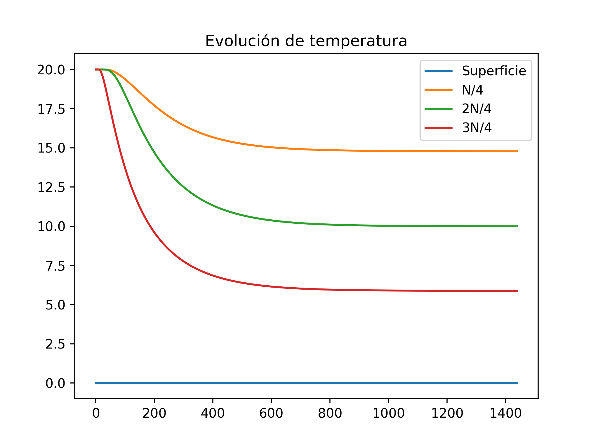

### Evolución de la temperatura en el tiempo en los puntos
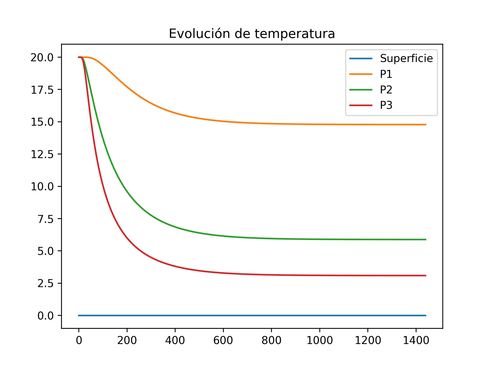

### Distribución de temperatura en los tiempos
### 0h

### 2h

### 6h

### 12h

### 14h

### Gif

## Caso 2
Las condiciones de borde para el segundo caso fueron las siguientes:
  + 20º Inicial
  + Borde Superior: 0º
  + Borde Izquierdo: 20º
  + Borde Inferior: 20º
  + Borde Derecho: Gradiente 0º

Esto se traduce en los siguientes términos del codigo :
  + u_k[:, :] = 20.                     #Inicial
  + u_k[:, -1] = 0.                     #Borde Superior
  + u_k[0, :] = 20.                     #Borde Izquierdo
  + u_k[:, 0] = 20.                     #Borde Inferior
  + u_k[-1, :] = u_k[-2, :] - 0. * dx   #Borde Derecho
  

### Evolución de la temperatura en el tiempo en los puntos
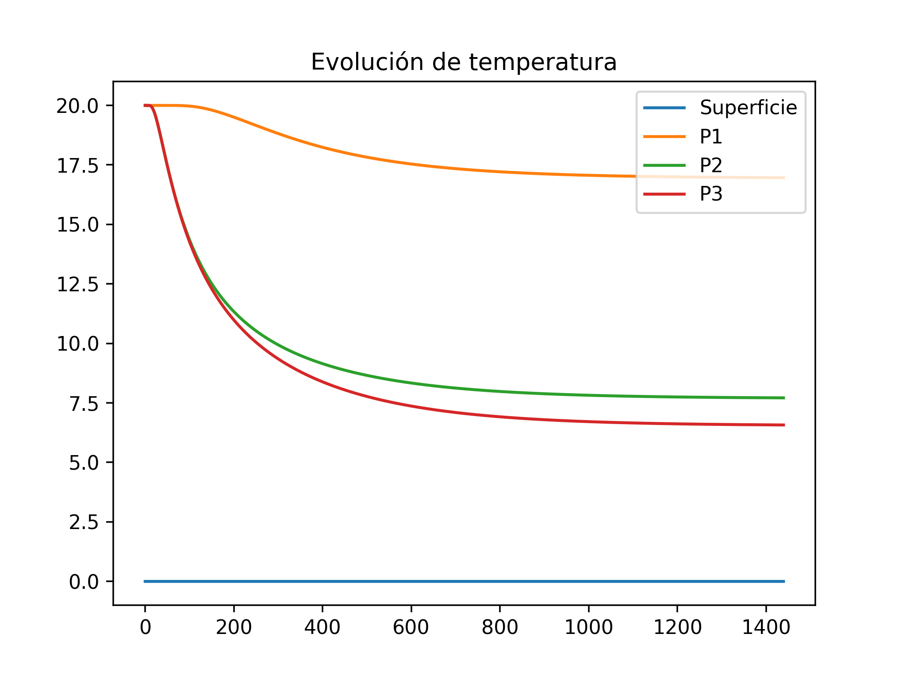

### Distribución de temperatura en los tiempos
### 0h

### 2h

### 6h
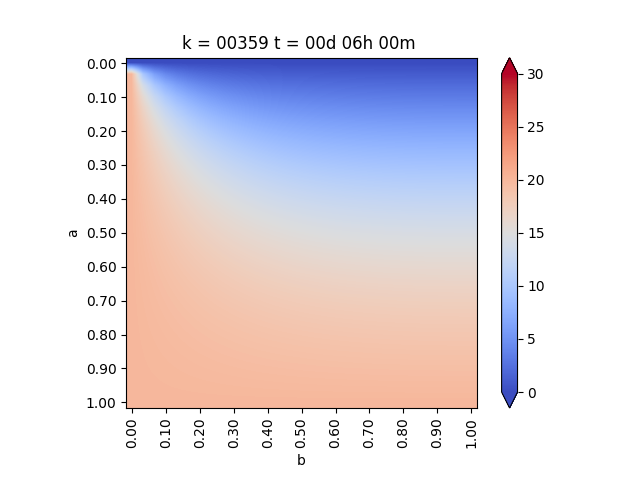
### 12h

### 14h

### Gif
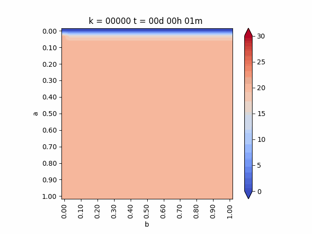

## Caso 3
Las condiciones de borde para el tercer caso fueron las siguientes:
  + 10º Inicial
  + Borde Superior: 0º
  + Borde Izquierdo: 20º
  + Borde Inferior: 20º
  + Borde Derecho: 20º

Esto se traduce en los siguientes términos del codigo :
  + u_k[:, :] = 10.   #Inicial
  + u_k[:, -1] = 0.   #Borde Superior
  + u_k[0, :] = 20.   #Borde Izquierdo
  + u_k[:, 0] = 20.   #Borde Inferior
  + u_k[-1, :] = 20.  #Borde Derecho

### Evolución de la temperatura en el tiempo en los puntos

### Distribución de temperatura en los tiempos
### 0h
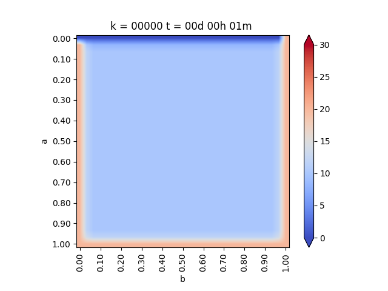
### 2h
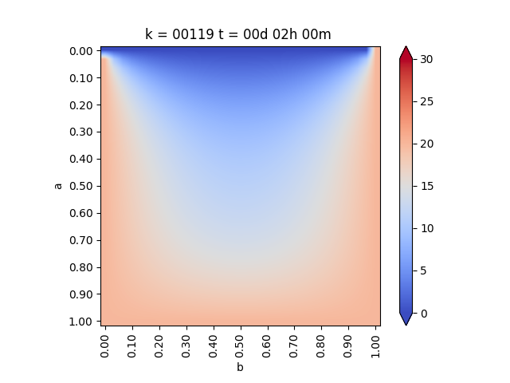
### 6h

### 12h

### 14h

### Gif

## Caso 4
Las condiciones de borde para el tercer caso fueron las siguientes:
  + 10º Inicial
  + Borde Superior: 0º
  + Borde Izquierdo: 20º
  + Borde Inferior: 20º
  + Borde Derecho: Gradiente 0º

Esto se traduce en los siguientes términos del codigo :
  + u_k[:, :] = 10.               #Inicial
  + u_k[:, -1] = 0.               #Borde Superior
  + u_k[0, :] = 20.               #Borde Izquierdo
  + u_k[:, 0] = 20.               #Borde Inferior
  + u_k[-1,:] = u_k[-2,:]- 0*dx   #Borde Derecho

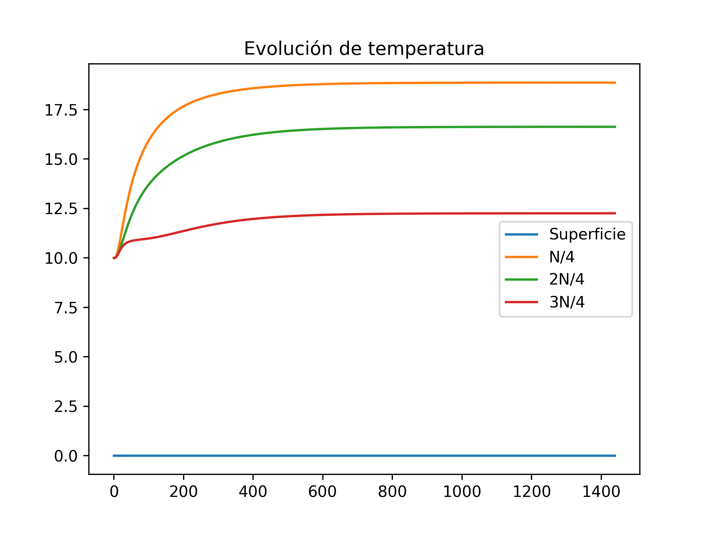

### Evolución de la temperatura en el tiempo en los puntos 

### Distribución de temperatura en los tiempos
### 0h

### 2h

### 6h

### 12h

### 14h

### Gif
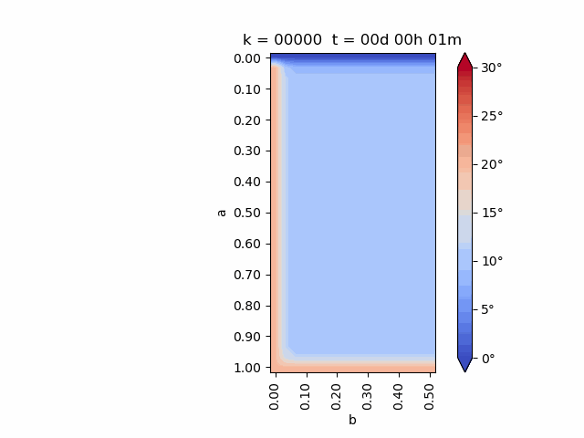

## Caso 5
Las condiciones de borde para el tercer caso fueron las siguientes:
  + 5º Inicial
  + Borde Superior: Gradiente 0º
  + Borde Izquierdo: 25º
  + Borde Inferior: Gradiente 0º
  + Borde Derecho: 25º

Esto se traduce en los siguientes términos del codigo :
  + u_k[:, :] = 5.                    #Inicial
  + u_k[:, -1] = u_k[:, -2] -0 * dy   #Borde Superior
  + u_k[0, :] = 25.                   #Borde Izquierdo
  + u_k[:, 0] = u_k[:, -1] - 0. * dy  #Borde Inferior
  + u_k[-1,:] = 25                    #Borde Derecho

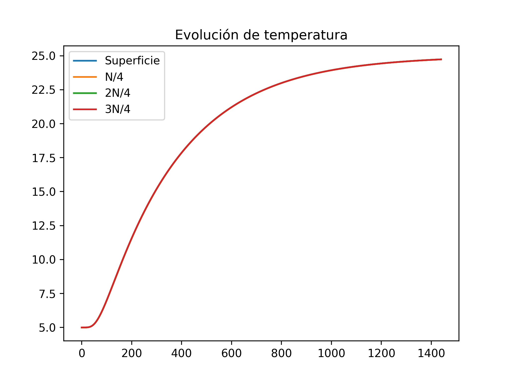

### Evolución de la temperatura en el tiempo en los puntos
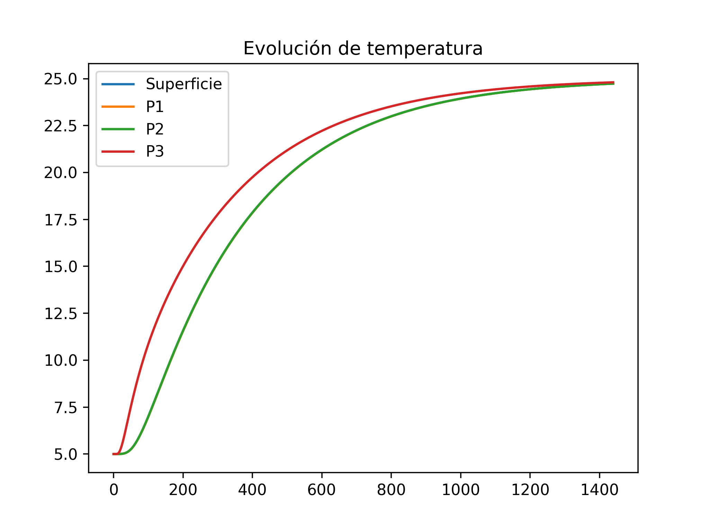

### Distribución de temperatura en los tiempos
### 0h

### 2h
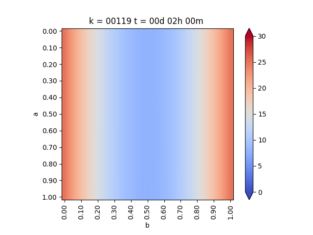
### 6h
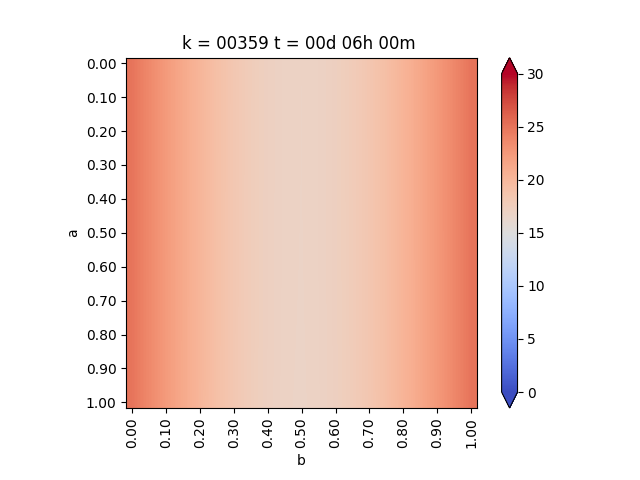
### 12h
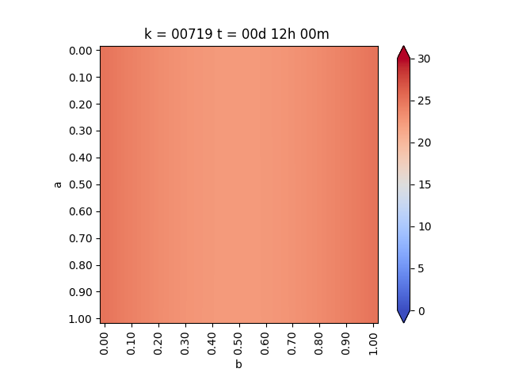
### 14h
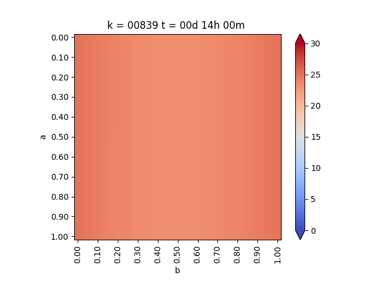
### Gif
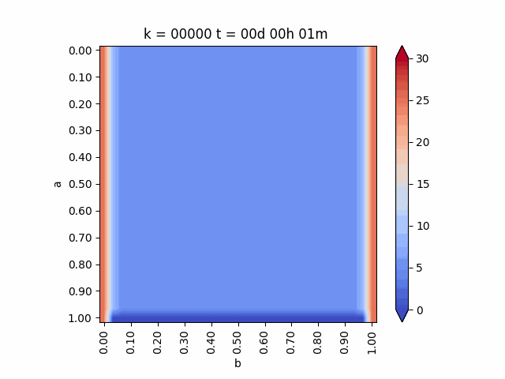

## Caso 6
Las condiciones de borde para el tercer caso fueron las siguientes:
  + 30º Inicial
  + Borde Superior: Gradiente 0º
  + Borde Izquierdo: 10º
  + Borde Inferior: Gradiente 0º
  + Borde Derecho: Gradiente 0º

Esto se traduce en los siguientes términos del codigo :
  + u_k[:, :] = 30.                    #Inicial
  + u_k[:, -1] = u_k[:, -2] -0 * dy    #Borde Superior
  + u_k[0, :] = u_k[:, -1] - 0. * dy   #Borde Izquierdo
  + u_k[:, 0] = u_k[:, -1] - 0. * dy   #Borde Inferior
  + u_k[-1,:] = u_k[-2, :] - 0. * dx   #Borde Derecho
  

### Evolución de la temperatura en el tiempo en los puntos
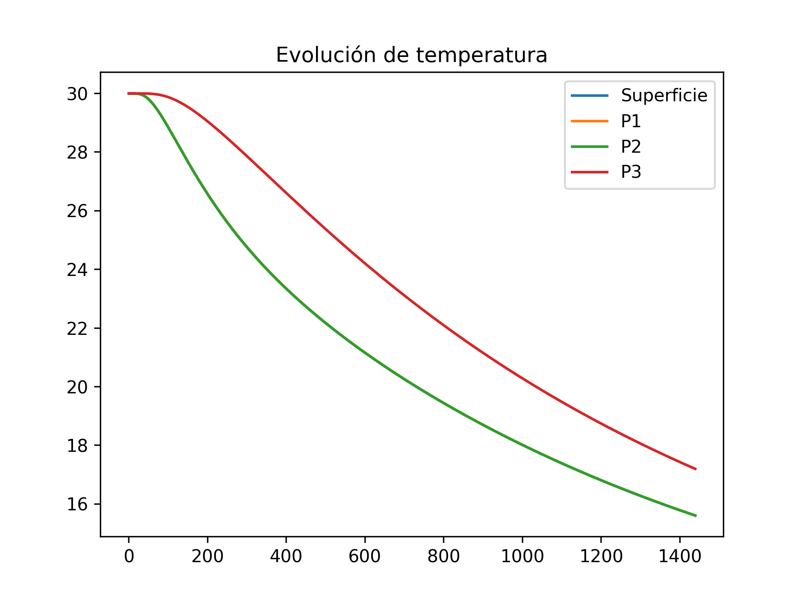

### Distribución de temperatura en los tiempos
### 0h

### 2h
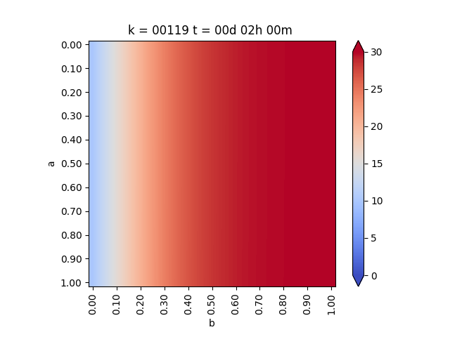
### 6h

### 12h

### 14h
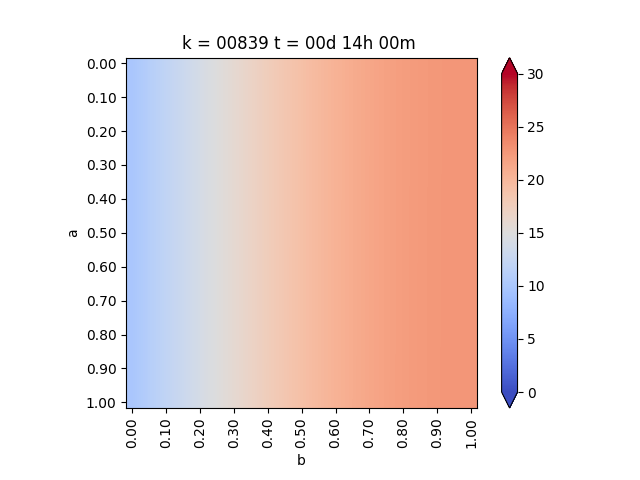
### Gif
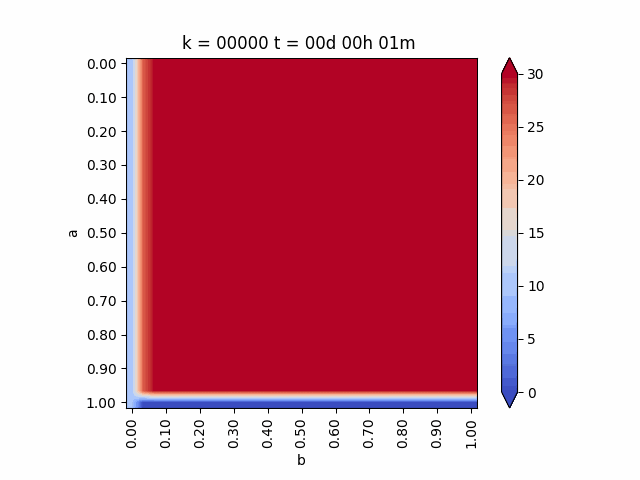

## Caso 7
Las condiciones de borde para el tercer caso fueron las siguientes:
  + 20º Inicial
  + Borde Superior: Temperatura ambiental (sinusoide con variación de 10º, periodo de 1 día)
  + Borde Izquierdo: Gradiente 0º
  + Borde Inferior: Gradiente 0º
  + Borde Derecho: Gradiente 0º

Esto se traduce en los siguientes términos del codigo :
  + u_k[:, :] = 20.                                       #Inicial
  + u_k[:, -1] = Tambiental = 20. + 10.*sin((2*pi/T)*t)   #Borde Superior
  + u_k[0, :] = u_k[-2, :] - 0 * dx                       #Borde Izquierdo
  + u_k[:, 0] = u_k[:, -1] - 0. * dy                      #Borde Inferior
  + u_k[-1,:] = u_k[-2, :] - 0. * dx                       #Borde Derecho
  
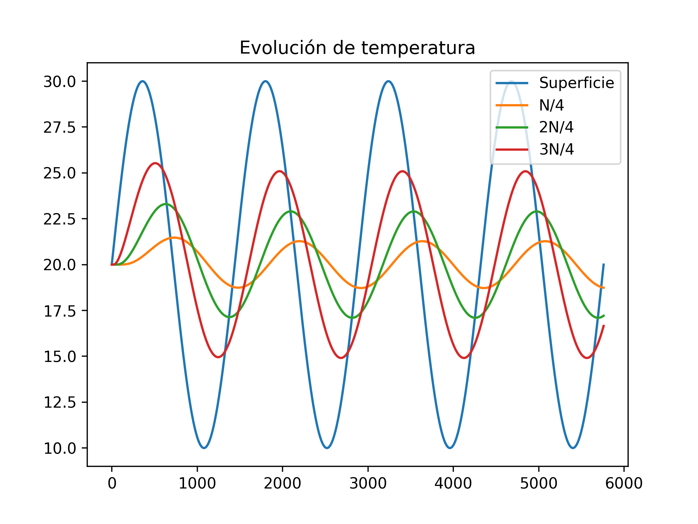

### Evolución de la temperatura en el tiempo en los puntos

### Distribución de temperatura en los tiempos
### 0h

### 2h
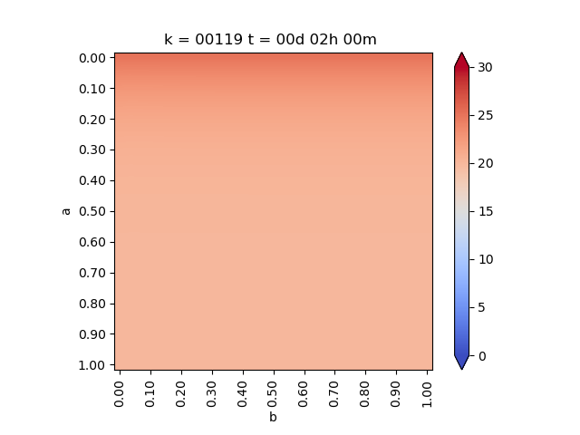
### 6h

### 12h

### 14h

### Gif
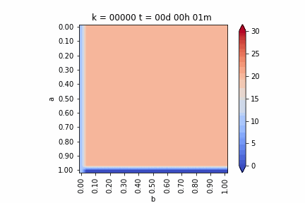

